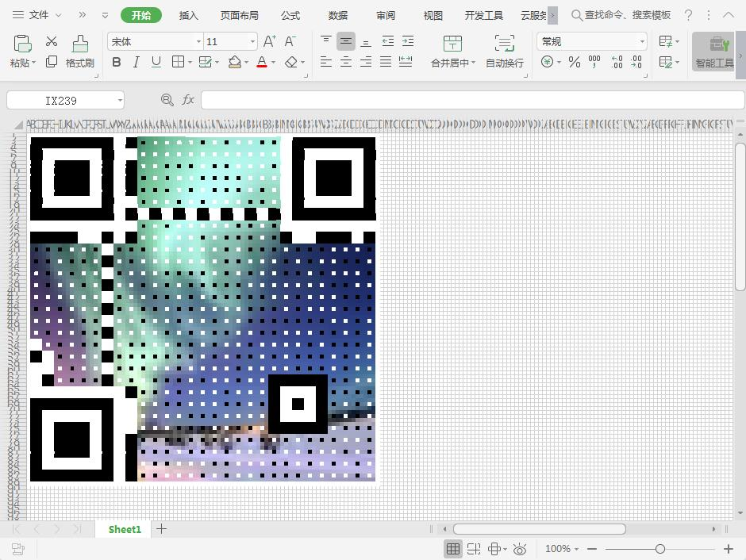

# pyqart_excel
Convert url or text to qr_art image and write to excel.

```bash
pyqart_excel https://github.com/cxgreat2014/pyqart_excel example.png
```

and switch to excel window, it will automatic paint qart pic in excel.



Enjoy it :P , just for fun.

Thanks to [7sDream](https://github.com/7sDream) and his [pyqart](https://github.com/7sDream/pyqart)
